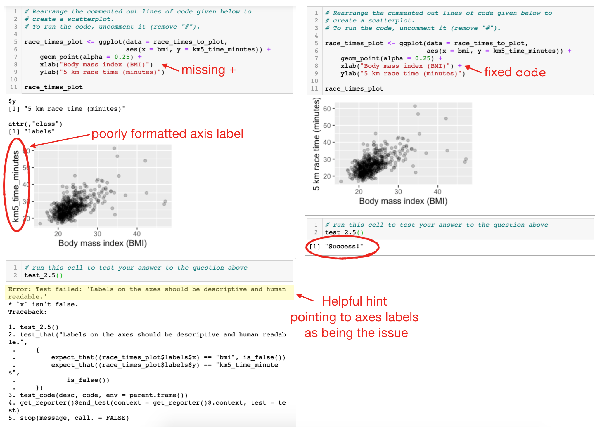
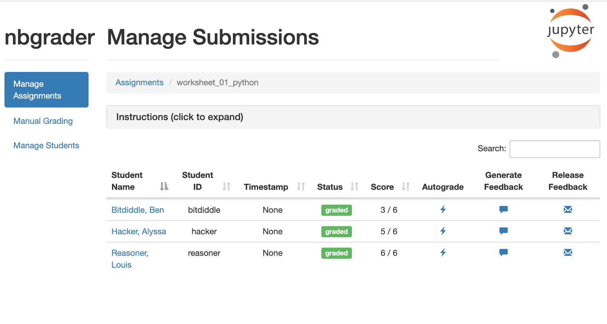
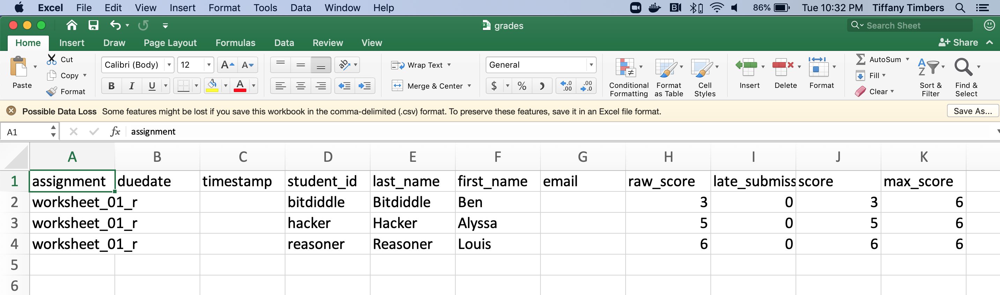
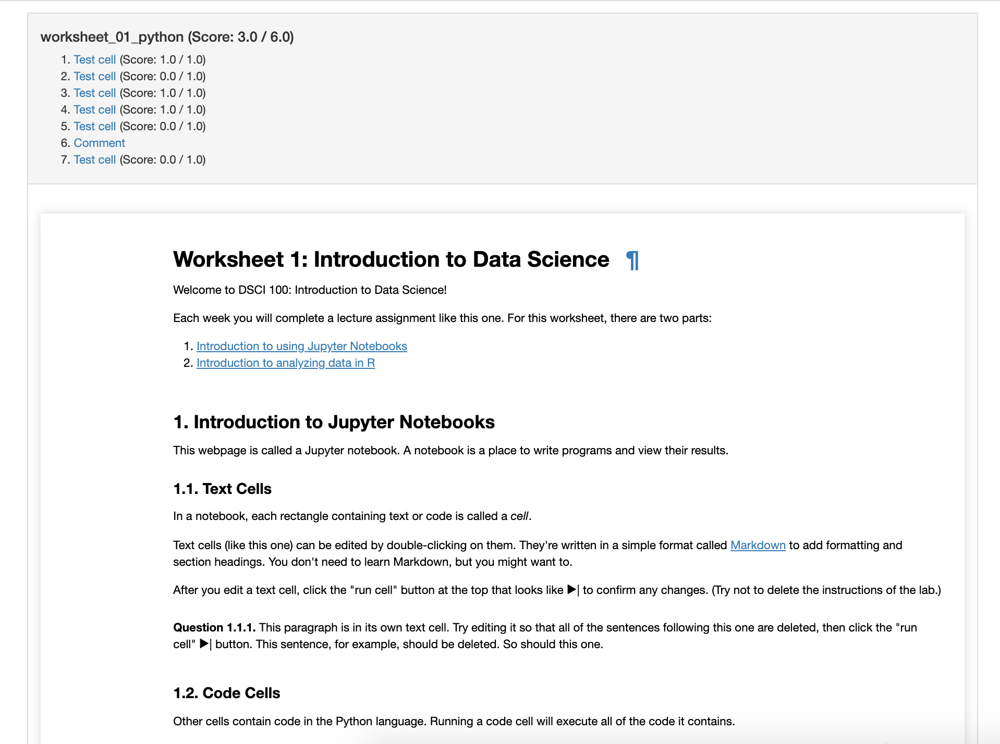
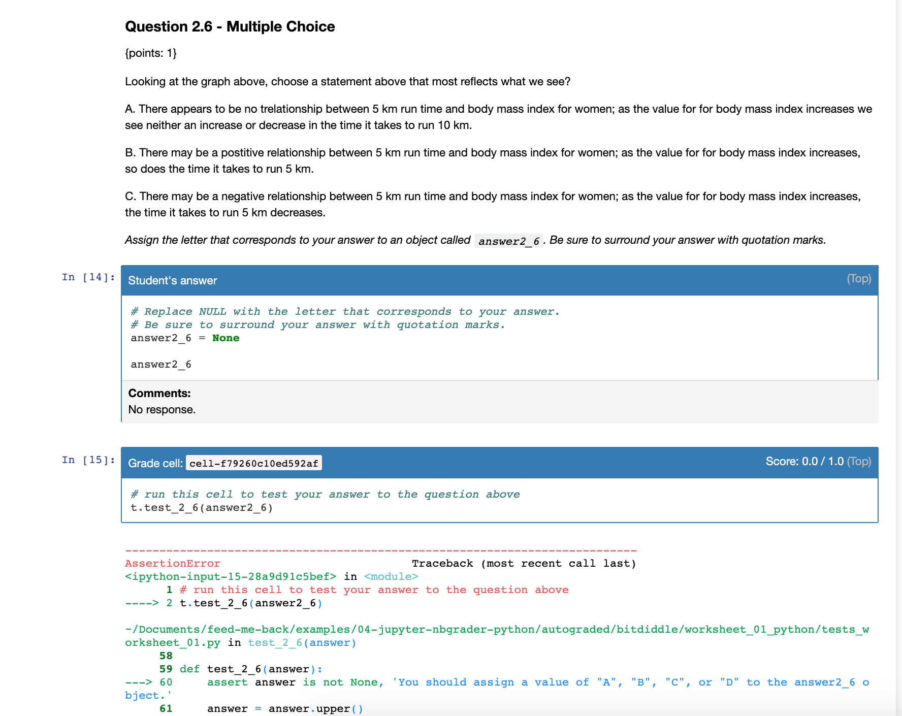

```{r xaringan-themer, include=FALSE, warning=FALSE}
library(xaringanthemer)
# color inspiration: pantone 2020 colors
# https://store.pantone.com/uk/en/color-of-the-year-2020-palette-exploration
style_duo_accent(
  primary_color = "#0F4C81",   # pantone classic blue
  secondary_color = "#DBCCBE", # pantone pink tint
  black_color = "#7A8387",     # pantone monument
  text_color = "#2A2A35",      # pantone night sky
  header_font_google = google_font("Arvo"),
  text_font_google   = google_font("Montserrat", "300", "300i"),
  code_font_google   = google_font("Source Code Pro"),
  title_slide_background_image = "images/robots-cover.jpeg",
  title_slide_text_color = "#0F4C81"
)
```

```{r load-packages, include=FALSE}
library(tidyverse)
library(usethis)
```

## Assumed background

```{r echo=FALSE, fig.align="center", out.width="30%"}
knitr::include_graphics("images/robots-background.png")
```

---

background-image: url(images/robots-what-why.jpeg)
background-position: center
background-repeat: no-repeat
background-size: contain
class: middle, inverse

# Automated feedback: 
# what and why?

---

## The what and the why

--
.pull-left[
.center[
.huge[`r emo::ji("point_right")`] <br>
.large[**Nudging**] <br>
students towards the right answer, especially in formative assessments
]
]
--
.pull-right[
.center[
.huge[`r emo::ji("heavy_plus_sign")`] <br>
.large[**Scaling**] <br>
up efficiency of grading faster than (human) resources
]
]

---

```{r include=FALSE}
set.seed(1234)
means <- rnorm(10) %>% round(2)
```

.sample-question[
Suppose 10 means from a simulated sampling distribution is stored in a vector called `means`.
```{r}
means
```
What is the value of the first mean?
]
--
<br>
.pull-left-wide[
.sample-answer[
```{r error=TRUE}
mean[1]
```
]
]
--
.pull-right-narrow[
```{r echo=FALSE, fig.align="right"}
knitr::include_graphics("images/student.png")
```
]

---

## Nudging

.hand-blue[Not all feedback is useful, at least not for beginners...]

<br>

Providing helpful feedback can help them nudge them towards success:

```{r eval=FALSE}
mean[1]
```

```{r echo=FALSE}
ui_oops("`mean` is a function and a function doesn't have elements that can be subsetted with square brackets.")
ui_info("`means` is the vector of sample means calculated earlier.")
```

---

.sample-question[
Visualise the relationship between city and highway mileage of cars from the `mpg` dataset, conditional on year of manufacture.
]

--
<br>
.sample-answer[
There is a strong, positive, linear relationship between the city and highway mileage of cars. Year does not seem to be related to either variable.
```{r message=FALSE, fig.height=2.5, fig.width=9, dpi=300, out.width="70%"}
ggplot(mpg,aes(x = hwy, y = cty, fill=year)) +geom_point()+geom_smooth()
```
]

---

class: middle

.pull-left-wide[
.sample-feedback[
- You mention a linear relationship, however your plot uses a loess fit to visualise the relationship between city and highway mileage. Also, the plot displays the uncertainty around the fit, but you haven't addressed it in your narrative.
- Year should be mapped to the `color` aesthetic, not `fill`. 
- Plot styling: Use informative axis labels, noting units of measurement. Also, give an informative title to your plot.
- Code styling: Use consistent spacing around operators (e.g ` = `) and line breaks after `+` in each layer of your ggplot.
]
]
.pull-right-narrow[
```{r echo=FALSE, fig.align="center"}
knitr::include_graphics("images/teacher.png")
```
]

---

## Scaling

.hand-blue[Our courses are growing, and that's a good thing, right?]

--

- Students turning in their work as R Markdown documents makes collecting submissions including code and narrative straightforward.

--

- Providing feedback on both the code and narrative is not scalable unless (human) resources dedicated to your course grow proportionally with enrolments.

---

background-image: url(images/robots-options.jpeg)
background-position: center
background-repeat: no-repeat
background-size: contain
class: middle, inverse

# Options for 
# automated feedback
# in R and Python

---

background-image: url(images/robot-r.jpeg)
background-position: center
background-repeat: no-repeat
background-size: contain
class: middle

## learnr / gradethis

---

## learnr

- **learnr** is an R package that makes it easy to create interactive tutorials from R Markdown documents.

- Tutorials can include:
  - Narrative, figures, illustrations, and equations
  - Code exercises (R code chunks that users can edit and execute directly)
  - Multiple choice questions
  - Videos (YouTube, Vimeo)
  - Interactive Shiny components

---

background-image: url(images/learnr-first-look.png)
background-position: center
background-repeat: no-repeat
background-size: contain
class: middle

---

## gradethis

Companion to the learnr package, **gradethis** provides multiple methods to grade learnr exercises:

- `grade_code()`: Grade code against a solution
- `grade_conditions()`: Grade all specified conditions
- `grade_result()`: Grade result of exercise code

---

background-image: url(images/robots-demo.jpeg)
background-position: center
background-repeat: no-repeat
background-size: contain
class: middle

## Demo: learnr / gradethis

[**`[tutorial]`**](https://minecr.shinyapps.io/nobel-laureates-learnr) 

[**`[code]`**](https://github.com/mine-cetinkaya-rundel/feed-me-back/blob/master/examples/01-learnr-gradethis/nobel-laureates-learnr.Rmd)

---

## FAQ for learnr and gradethis

--

**Q: What is the best way to get started?**

Start with exercise code chunks for developing analysis and multiple choice 
questions for assessment. [[example]](https://minecr.shinyapps.io/08-modeling-multiple/)

--

**Q: Is it possible to record student data?**

Yes, though not trivial, at this point. See [**submitter**](https://github.com/dtkaplan/submitr) by Danny Kaplan.

A solution that is "good enough" for formative exercises: embed a Google/Microsoft/etc. Form at the end and ask students to "sign in" their work.

---

background-image: url(images/robot-r.jpeg)
background-position: center
background-repeat: no-repeat
background-size: contain
class: middle

## R Markdown / GitHub Actions

---

background-image: url(images/robot-r-python.jpeg)
background-position: center
background-repeat: no-repeat
background-size: contain
class: middle

## Jupyter / nbgrader

---

## What is Jupyter?


.pull-left[
```{r echo=FALSE, fig.align="center", out.width="150%"}
knitr::include_graphics("images/jupyter-r.png")
```
]
--
.pull-right[
```{r echo=FALSE, fig.align="center", out.width="100%"}

```
]

---

## Tests as automated feedback

```{r echo=FALSE, fig.align="center", out.width="75%"}

```

---

## Autograding via nbgrader

```{r echo=FALSE, fig.align="center", out.width="75%"}

```

---

## Autograding via nbgrader

```{r echo=FALSE, fig.align="center", out.width="75%"}

```

---

## Autograding via nbgrader

.pull-left[
```{r echo=FALSE, fig.align="center", out.width="130%"}

```
]
--
.pull-right[
```{r echo=FALSE, fig.align="center", out.width="130%"}

```
]

---

background-image: url(images/robots-demo.jpeg)
background-position: center
background-repeat: no-repeat
background-size: contain
class: middle

## Demo: Jupyter + nbgrader with R

[**`[R notebook]`**](https://mybinder.org/v2/gh/ttimbers/jupyter-demo/master?filepath=jupyter-nbgrader-r%2Frelease%2Fworksheet_01_r%2Fworksheet_01_r.ipynb) 

[**`[R code]`**](https://github.com/mine-cetinkaya-rundel/feed-me-back/tree/master/examples/03-jupyter-nbgrader-r)

---

background-image: url(images/robots-demo.jpeg)
background-position: center
background-repeat: no-repeat
background-size: contain
class: middle

## Demo: Jupyter + nbgrader with Python

[**`[Python notebook]`**](https://mybinder.org/v2/gh/ttimbers/jupyter-demo/master?filepath=jupyter-nbgrader-python%2Frelease%2Fworksheet_01_python%2Fworksheet_01_python.ipynb) 

[**`[Python code]`**](https://github.com/mine-cetinkaya-rundel/feed-me-back/tree/master/examples/04-jupyter-nbgrader-python)

---

class: middle, inverse

# Closing thoughts

---

## Best practices for automated feedback

--

- Measure twice, cut once (verify the correctness of your tests). 📏📏 ✂️

--

- Use rounding & type coercion to write robust tests. 💪

--

- Use hashing to hide solutions for visible tests. 🕵️

--

- Test your tests on the students compute environment. 💻

--

- Abstract your tests to a script that is sourced/imported into the students literate code document. 📁

--

- Don't give automated feedback on everything. 🙈

---

## Resources

- learnr:
  - [learnr](https://rstudio.github.io/learnr) package documentation
  - CAUSE Webinar: [Interactive R tutorials with learnr](https://www.causeweb.org/cause/webinar/teaching/2018-05) (May 2018)
- [gradethis](https://rstudio-education.github.io/gradethis/) package documentation

- [nbgrader docs](https://nbgrader.readthedocs.io/en/stable/) (autograding in Jupyter notebooks)

- [examples of R Jupyter notebooks with automated feedback from UBC's DSCI 100 course](https://github.com/UBC-DSCI/dsci-100-assets/tree/master/2019-spring/materials)

- [examples of Python Jupyter notebooks with automated feedback from Berkley's data8 course](https://github.com/data-8/data8assets/tree/gh-pages/materials/su17/lab)

---

background-image: url(images/robots-last.jpeg)
background-position: center
background-repeat: no-repeat
background-size: contain
class: middle, inverse

.todo[last slide, link, info, etc.]