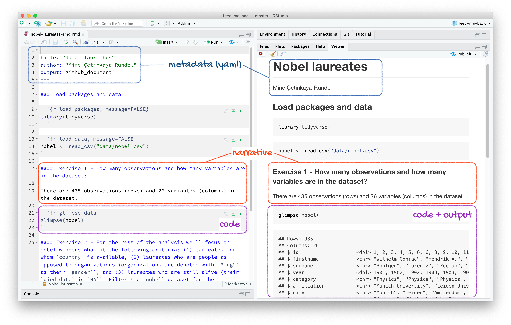
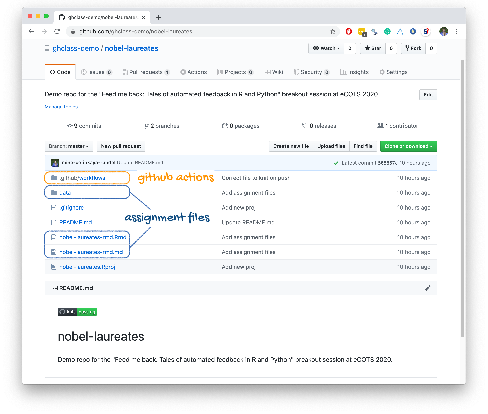
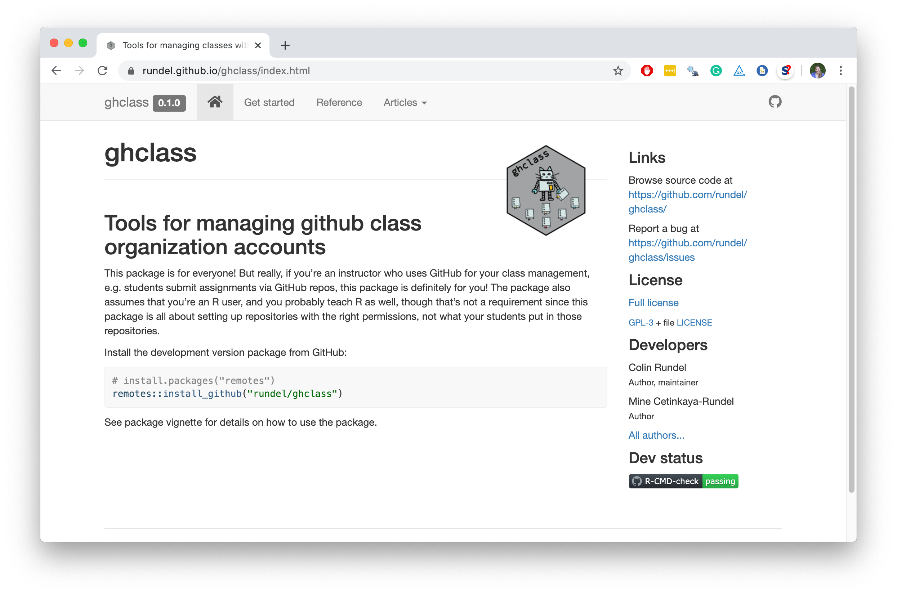

```{r xaringan-themer, include=FALSE, warning=FALSE}
library(xaringanthemer)
# color inspiration: pantone 2020 colors
# https://store.pantone.com/uk/en/color-of-the-year-2020-palette-exploration
style_duo_accent(
  primary_color = "#0F4C81",   # pantone classic blue
  secondary_color = "#DBCCBE", # pantone pink tint
  black_color = "#7A8387",     # pantone monument
  text_color = "#2A2A35",      # pantone night sky
  header_font_google = google_font("Arvo"),
  text_font_google   = google_font("Montserrat", "300", "300i"),
  code_font_google   = google_font("Source Code Pro"),
  title_slide_background_image = "images/robots-cover.jpeg",
  title_slide_text_color = "#0F4C81"
)
```

```{r load-packages, include=FALSE}
library(tidyverse)
library(usethis)
```

background-image: url(images/robots-background.jpeg)
background-position: center
background-repeat: no-repeat
background-size: contain

## Assumed background

---

background-image: url(images/robots-what-why.jpeg)
background-position: center
background-repeat: no-repeat
background-size: contain
class: middle, inverse

# Automated feedback: 
# what and why?

---

## The what and the why

--
.pull-left[
.center[
.huge[`r emo::ji("point_right")`] <br>
.large[**Nudging**] <br>
students towards the right answer, especially in formative assessments
]
]
--
.pull-right[
.center[
.huge[`r emo::ji("heavy_plus_sign")`] <br>
.large[**Scaling**] <br>
up efficiency of grading faster than (human) resources
]
]

---

```{r include=FALSE}
set.seed(1234)
means <- rnorm(10) %>% round(2)
```

.sample-question[
Suppose 10 means from a simulated sampling distribution is stored in a vector called `means`.
```{r}
means
```
What is the value of the first mean?
]
--
<br>
.pull-left-wide[
.sample-answer[
```{r error=TRUE}
mean[1]
```
]
]
--
.pull-right-narrow[
```{r echo=FALSE, fig.align="right"}
knitr::include_graphics("images/student.png")
```
]

---

## Nudging

.hand-blue[Not all feedback is useful, at least not for beginners...]

<br>

Providing helpful feedback can help them nudge them towards success:

```{r eval=FALSE}
mean[1]
```

```{r echo=FALSE}
ui_oops("`mean` is a function and a function doesn't have elements that can be subsetted with square brackets.")
ui_info("`means` is the vector of sample means calculated earlier.")
```

---

.sample-question[
Visualise the relationship between city and highway mileage of cars from the `mpg` dataset, conditional on year of manufacture.
]

--
<br>
.sample-answer[
There is a strong, positive, linear relationship between the city and highway mileage of cars. Year does not seem to be related to either variable.
```{r message=FALSE, fig.height=2.5, fig.width=9, dpi=300, out.width="70%"}
ggplot(mpg,aes(x = hwy, y = cty, fill=year)) +geom_point()+geom_smooth()
```
]

---

class: middle

.pull-left-wide[
.sample-feedback[
- You mention a linear relationship, however your plot uses a loess fit to visualise the relationship between city and highway mileage. Also, the plot displays the uncertainty around the fit, but you haven't addressed it in your narrative.
- Year should be mapped to the `color` aesthetic, not `fill`. 
- Plot styling: Use informative axis labels, noting units of measurement. Also, give an informative title to your plot.
- Code styling: Use consistent spacing around operators (e.g ` = `) and line breaks after `+` in each layer of your ggplot.
]
]
.pull-right-narrow[
```{r echo=FALSE, fig.align="center"}
knitr::include_graphics("images/teacher.png")
```
]

---

## Scaling

.hand-blue[Our courses are growing, and that's a good thing, right?]

--

- Students turning in their work as R Markdown documents makes collecting submissions including code and narrative straightforward.

--

- Providing feedback on both the code and narrative is not scalable unless (human) resources dedicated to your course grow proportionally with enrolments.

---

background-image: url(images/robots-options.jpeg)
background-position: center
background-repeat: no-repeat
background-size: contain
class: middle, inverse

# Options for 
# automated feedback
# in R and Python

---

background-image: url(images/robot-r.jpeg)
background-position: center
background-repeat: no-repeat
background-size: contain
class: middle

## learnr / gradethis

---

## learnr

- **learnr** is an R package that makes it easy to create interactive tutorials from R Markdown documents.

- Tutorials can include:
  - Narrative, figures, illustrations, and equations
  - Code exercises (R code chunks that users can edit and execute directly)
  - Multiple choice questions
  - Videos (YouTube, Vimeo)
  - Interactive Shiny components

---

background-image: url(images/learnr-first-look.png)
background-position: center
background-repeat: no-repeat
background-size: contain
class: middle

---

## gradethis

Companion to the learnr package, **gradethis** provides multiple methods to grade learnr exercises:

- `grade_code()`: Grade code against a solution
- `grade_conditions()`: Grade all specified conditions
- `grade_result()`: Grade result of exercise code

---

background-image: url(images/robots-demo.jpeg)
background-position: center
background-repeat: no-repeat
background-size: contain
class: middle

### Demo: learnr / gradethis

[**`[tutorial]`**](https://minecr.shinyapps.io/nobel-laureates-learnr) 

[**`[code]`**](https://github.com/mine-cetinkaya-rundel/feed-me-back/blob/master/examples/01-learnr-gradethis/nobel-laureates-learnr.Rmd)

---

background-image: url(images/robots-faq.jpeg)
background-position: center
background-repeat: no-repeat
background-size: contain

## FAQ: learnr / gradethis

---

.large[
.hand-blue[Q: What is an approachable way to get started?]
]

Build a tutorial where students build develop their analysis in exercise code 
chunks (that are not checked) and only multiple choice questions are used for 
assessment. [**`[example]`**](https://minecr.shinyapps.io/04-wrangleviz)

```{r echo=FALSE, out.width="85%", fig.align="center"}
knitr::include_graphics("images/learnr-simple.png")
```

---

.large[
.hand-blue[Q: Is it possible to record student data?]
]

Yes, though not trivial, at this point. See [recording events](https://rstudio.github.io/learnr/publishing.html#Recording_Events) section on the learnr documentation and the [**submitter**](https://github.com/dtkaplan/submitr) package by Danny Kaplan.

A solution that may be "good enough" for formative exercises: embed a 
Google/Microsoft/etc. Form at the end and ask students to "sign in" their work.
**Tip:** Add a free-text question to this form where students reflect on the 
exercises they just completed, and you can easily capture and analyze. [**`[example]`**](https://minecr.shinyapps.io/04-wrangleviz/#section-finish-up)

```{r echo=FALSE, out.width="60%", fig.align="center"}
knitr::include_graphics("images/learnr-logging.png")
```

---

.large[
.hand-blue[Q: I've built simple tutorials already. How do I make the jump to code checking and providing automated feedback that is actually useful?]
]

- Replicate `gradethis::gradethis_demo()`, then make incremental changes
- Read the [Testing](https://r-pkgs.org/tests.html#test-tests) chapter in R Packages (Wickham and Bryan) 
- Also read the [Metaprogramming](https://adv-r.hadley.nz/metaprogramming.html) section in Advanced R (Wickham)

```{r echo=FALSE, out.width="75%", fig.align="center"}
knitr::include_graphics("images/learnr-learn-more.jpeg")
```

---

background-image: url(images/robot-r.jpeg)
background-position: center
background-repeat: no-repeat
background-size: contain
class: middle

## R Markdown / GitHub Actions

---

## R Markdown

```{r echo=FALSE, out.width="80%", fig.align="center"}

```

---

## GitHub

```{r echo=FALSE, out.width="80%", fig.align="center"}

```

---

background-image: url(images/github-actions.jpeg)
background-position: center
background-repeat: no-repeat
background-size: contain

## GitHub Actions

Cause-and-effect automation tool for orchestrating workflows based on any event (e.g. student pushing their work to repo, deadline passing, etc.) on GitHub.

---

## Workflow

- Each assignment is a *private* repository on GitHub created by the instructor with appropriate permissions given to individual students

--

- At the beginning of the assignment, instructor places 
  - template R Markdown document for students to fill in and
  - workflow files that outline when GitHub actions should be run and what they should check
  - badges to inform students of the status of these checkes
  
--

- Students get feedback as they work on the assignment or after the deadline

---

background-image: url(images/robots-demo.jpeg)
background-position: center
background-repeat: no-repeat
background-size: contain
class: middle

### Demo: R Markdown / GitHub Actions

[**`[repo]`**](https://github.com/ghclass-demo/nobel-laureates) 

[**`[actions]`**](https://github.com/ghclass-demo/nobel-laureates/tree/master/.github/workflows)

---

background-image: url(images/robots-faq.jpeg)
background-position: center
background-repeat: no-repeat
background-size: contain

## FAQ: R Markdown / GitHub Actions

---

.large[
.hand-blue[Q: How can I get started with having my students use Git and GitHub to manage and collaborate on their work?]
]

- Read the [get started](https://rundel.github.io/ghclass/articles/ghclass.html) guide on the **ghclass** package website
- Test out [ghclass](https://rundel.github.io/ghclass/index.html), an R package for managing a GitHub class organisation

```{r echo=FALSE, out.width="85%", fig.align="center"}

```

---

.large[
.hand-blue[Q: Can I see more GitHub actions in action?]
]

.pull-left[
We're collecting examples of GitHub actions useful for checking data science assignments at [github.com/rundel/ghclass-actions](https://github.com/rundel/ghclass-actions).
]
.pull-right[
```{r echo=FALSE, fig.align="center"}
knitr::include_graphics("images/ghclass-actions.png")
```
]

---

background-image: url(images/robot-r-python.jpeg)
background-position: center
background-repeat: no-repeat
background-size: contain
class: middle

## Jupyter / nbgrader

---

## What is Jupyter?

---

## Tests as automated feedback

---

## Autograding via nbgrader

---

background-image: url(images/robots-demo.jpeg)
background-position: center
background-repeat: no-repeat
background-size: contain
class: middle

## Demo!

---

class: middle, inverse

# Closing thoughts

---

## Best practices for automated feedback

- Measure twice, cut once (verify the correctness of your tests).

- Use rounding & type coercion to write robust tests.

- Use hashing to hide solutions for visible tests.

- Test your tests on the students compute environment.

- Abstract your tests to a script that is sourced/imported into the students literate code document.

- Don't give automated feedback on everything.

---

## Resources

- learnr / gradethis:
  - Package documentation: [learnr](https://rstudio.github.io/learnr), [gradethis](https://rstudio-education.github.io/gradethis/)
  - CAUSE Webinar: [Interactive R tutorials with learnr](https://www.causeweb.org/cause/webinar/teaching/2018-05) (May 2018)
  - [Source code for RStudio Primers](https://github.com/rstudio-education/primers)
  - learnr for remote teaching: [Blog post](https://education.rstudio.com/blog/2020/05/learnr-for-remote/) + [sample tutorial](https://allisonhorst.shinyapps.io/missingexplorer/) featuring custom styling by Allison Horst

- R Markdown / GitHub actions:
  - Still not using R Markdown in your courses? [R Markdown: Integrating A Reproducible Analysis Tool into Introductory Statistics](https://escholarship.org/uc/item/90b2f5xh) (Baumer et al., 2014)
  - Need Git convincing? [Infrastructure and Tools for Teaching Computing Throughout the Statistical Curriculum](https://www.tandfonline.com/doi/abs/10.1080/00031305.2017.1397549) (Çetinkaya-Rundel and Rundel, 2017) and [Implementing version control with Git as a learning objective in statistics courses](https://arxiv.org/abs/2001.01988) (Beckman et al., 2020)
  - ghclass resources: [package documentation](https://rundel.github.io/ghclass/index.html), [sample actions](https://github.com/rundel/ghclass-actions)
  
- Jupyter / nbgrader: [nbgrader documentation](https://nbgrader.readthedocs.io/en/stable/)

---

background-image: url(images/robots-last.jpeg)
background-position: center
background-repeat: no-repeat
background-size: contain
class: middle, inverse

.todo[last slide, link, info, etc.]